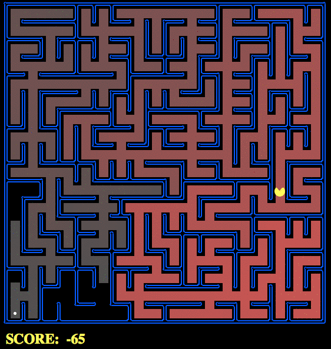

## pacmanAI

An additional lab in the [Artificial Intelligence Nanodegree program](https://classroom.udacity.com/nanodegrees/nd889/syllabus), designed to play through Pacman! The full [Pacman project and details](https://inst.eecs.berkeley.edu/~cs188/fa10/projects/search/search.html) are available from Berkley. 

To do this, we had to define code dealing with **Depth-First Search**, **Breadth-First Search**, **Uniform-Cost Search** / **Cheapest-First**, and the venerable **A\* Star Search** which uses a combination of cost and a heuristic to further improve our Pacman's performance. 

### Setup

Please note that the *majority of this code is not mine*, and is maintained by the amazing guys over at Berkely, and brought to my attention by [Udacity](https://classroom.udacity.com/nanodegrees/nd889/parts/6be67fd1-9725-4d14-b36e-ae2b5b20804c/modules/f719d723-7ee0-472c-80c1-663f02de94f3/lessons/36fc5b2f-6367-4808-b87c-0faa42744994/concepts/3dae9a09-7c7c-4bdd-8747-559f4a08f377). `search.py` specifically has been modified to include my own attempts at solving this project. 

This project requires Python 2 (Preferably as distributed by [Anaconda](https://www.continuum.io/downloads)) and can be visaluzed via [Pygame](http://www.pygame.org/download.shtml) to get a visualization like the one above. 

After setting up (and jumping in the environment), this project can be run via the following commands:

        python2 pacman.py
        python2 pacman.py --layout testMaze --pacman GoWestAgent
        python2 pacman.py --layout tinyMaze --pacman GoWestAgent
        python2 pacman.py -h
        python2 pacman.py -l tinyMaze -p SearchAgent -a fn=tinyMazeSearch
        python2 pacman.py -l tinyMaze -p SearchAgent
        python2 pacman.py -l mediumMaze -p SearchAgent
        python2 pacman.py -l bigMaze -z .5 -p SearchAgent
        python2 pacman.py -l mediumMaze -p SearchAgent -a fn=bfs
        python2 pacman.py -l bigMaze -p SearchAgent -a fn=bfs -z .5
        python2 eightpuzzle.py
        python2 pacman.py -l mediumMaze -p SearchAgent -a fn=ucs
        python2 pacman.py -l mediumDottedMaze -p StayEastSearchAgent
        python2 pacman.py -l mediumScaryMaze -p StayWestSearchAgent
        python2 pacman.py -l bigMaze -z .5 -p SearchAgent -a fn=astar,heuristic=manhattanHeuristic 
        python2 pacman.py -l tinyCorners -p SearchAgent -a fn=bfs,prob=CornersProblem
        python2 pacman.py -l mediumCorners -p SearchAgent -a fn=bfs,prob=CornersProblem
        python2 pacman.py -l mediumCorners -p AStarCornersAgent -z 0.5
        python2 pacman.py -l testSearch -p AStarFoodSearchAgent
        python2 pacman.py -l trickySearch -p AStarFoodSearchAgent
        python2 pacman.py -l bigSearch -p ClosestDotSearchAgent -z .5 
        python2 pacman.py -l bigSearch -p ApproximateSearchAgent -z .5 -q 

These haven't all been implemented, but the attemps are ongoing!

### Progress

- [x] **Question 1** (2 points): Implement the depth-first search (DFS) algorithm in the depthFirstSearch function in search.py. To make your algorithm complete, write the graph search version of DFS, which avoids expanding any already visited states. Should quickly find a solution for:

    python pacman.py -l tinyMaze -p SearchAgent
    python pacman.py -l mediumMaze -p SearchAgent
    python pacman.py -l bigMaze -z .5 -p SearchAgent

- [x] **Question 2** (1 point): Implement the breadth-first search (BFS) algorithm in the breadthFirstSearch function in `search.py`. Again, write a graph search algorithm that avoids expanding any already visited states. Test your code the same way you did for depth-first search:

    python pacman.py -l mediumMaze -p SearchAgent -a fn=bfs
    python pacman.py -l bigMaze -p SearchAgent -a fn=bfs -z .5
 
- [x] **Question 3** (2 points): Implement the uniform-cost graph search algorithm in the uniformCostSearch function in `search.py`. We encourage you to look through `util.py` for some data structures that may be useful in your implementation. You should now observe successful behavior in all three of the following layouts, where the agents below are all UCS agents that differ only in the cost function they use (the agents and cost functions are written for you):

    python pacman.py -l mediumMaze -p SearchAgent -a fn=ucs
    python pacman.py -l mediumDottedMaze -p StayEastSearchAgent
    python pacman.py -l mediumScaryMaze -p StayWestSearchAgent

- [x] **Question 4** (3 points): Implement A* graph search in the empty function aStarSearch in search.py. A* takes a heuristic function as an argument. Heuristics take two arguments: a state in the search problem (the main argument), and the problem itself (for reference information). The `nullHeuristic` heuristic function in `search.py` is a trivial example. Test your A* implementation on the original problem of finding a path through a maze to a fixed position using the Manhattan distance heuristic (implemented already as `manhattanHeuristic` in `searchAgents.py`).

        python pacman.py -l bigMaze -z .5 -p SearchAgent -a fn=astar,heuristic=manhattanHeuristic 

- [ ] **Question 5** (2 points) Implement the CornersProblem search problem in `searchAgents.py`. You will need to choose a state representation that encodes all the information necessary to detect whether all four corners have been reached. Now, your search agent should solve:

    python pacman.py -l tinyCorners -p SearchAgent -a fn=bfs,prob=CornersProblem
    python pacman.py -l mediumCorners -p SearchAgent -a fn=bfs,prob=CornersProblem

        